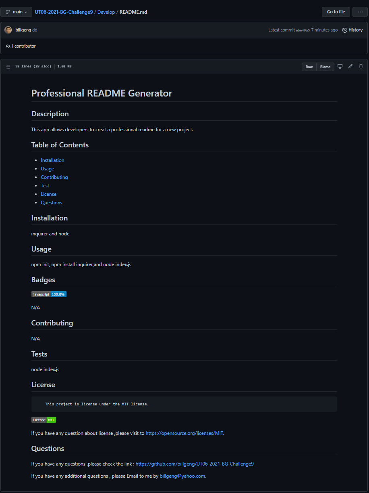

# Professional README Generator

## Description

This app allows the developers to create a new readme for a new project.

https://github.com/billgeng/UT06-2021-BG-Challenge9/blob/main/Develop/README.md

## Table of Contents

- [Installation](#installation)
- [Usage](#usage)
- [Contributing](#contributing)
- [Test](#tests)
- [License](#license)
- [Questions](#questions)

## Installation

npm init , inquirer,node index.js

## Usage

npm init, npm install inquirer,node index.js

## Badges

N/A

## Contributing

N/A

## Tests

node index.js

## License

        This project is license under the MIT license.

If you have any question about license ,please visit to https://opensource.org/licenses/MIT.

## Questions

If you have any questions ,please check the link : https://github.com/billgeng/UT06-2021-BG-Challenge9

If you have any additional questions , please Email to me by billgeng@yahoo.com.
